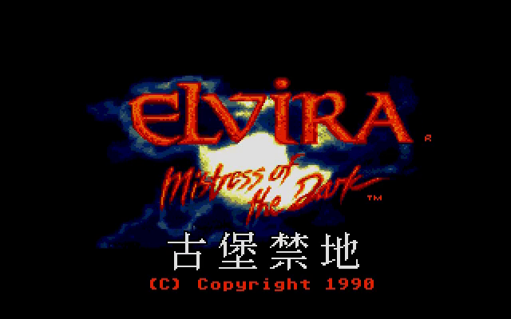
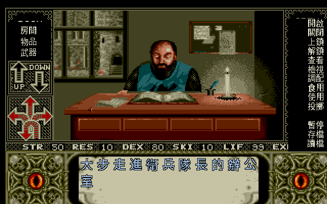
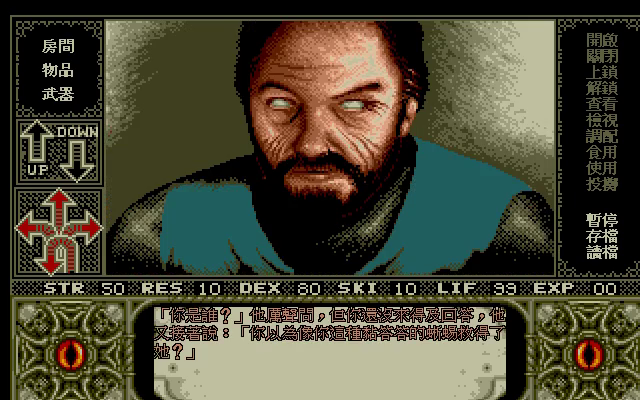
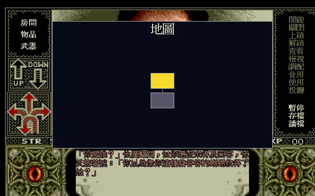
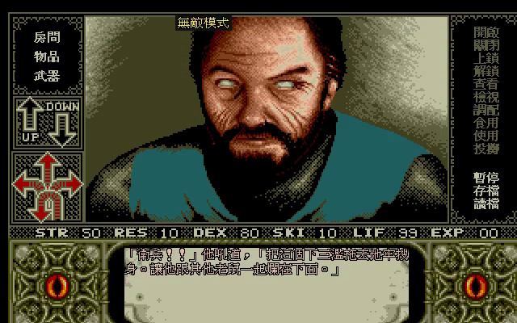
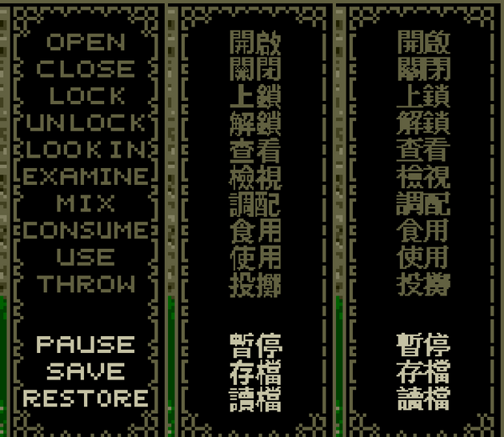

# 古堡禁地 — Elvira: Mistress of the Dark（1990）繁體中文化

> 「嗨！諸位勇士，我是 Elvira，全美最著名的靈異節目主持人，也是古堡的繼承者。瞧，我已經將陰森恐怖的古堡重新裝修，想趁好萊塢之夜大撈一筆。誰知道，我那死於百年前的曾曾祖母——**愛梅達女爵**——即將復活！請求勇士們，幫我收拾那些嚇人的怪物及討厭的衛士，並阻止愛梅達的復活。」
>
> —— 軟體世界珍藏版 118《古堡禁地》封底文案（1991）

<p align="center">
  
  <br><em>片頭 ELVIRA 遊戲名畫面，疊上繁中標題「古堡禁地」</em>
  <br><sub>本頁截圖皆為 <b>倚天中文系統點陣字</b>（1990 年 DOS 中文的字形原貌）。倚天字模有版權不隨庫散布，
  Release 內建 Noto Sans CJK 烘的同尺寸版本；自備字模者一行指令即可換上，見 <a href="NOTICE.md">NOTICE.md</a>。</sub>
</p>

## ▶ 推廣片

實機畫面 + 原版 MT-32 配樂，帶你看它說中文的樣子：

<p align="center">
  <a href="https://youtu.be/ny5p6eKh8JE">
    <br>
    ▶ 在 YouTube 觀看（78 秒，倚天字形 + MT-32 原版配樂）
  </a>
</p>

> 也可到 [Releases](../../releases/latest) 下載影片原檔 `Elvira1-CHT-promo.mp4`。

---

這是 1990 年恐怖冒險經典 **《Elvira - Mistress of the Dark》** 的繁體中文化專案。基於 [ScummVM](https://www.scummvm.org/) 的 AGOS 引擎，以**最小且乾淨的引擎 patch** 注入繁體中文——遊戲原檔一個位元都不改，執行時依字串 id 查表換成中文。譯名以 **1991 年軟體世界（智冠）官方珍藏版說明書** 為最高權威，並對照現代玩家熟悉的稱呼。

本 repo **只放 patch 與繁中資產**（`.patch`＋字型＋譯文）；遊戲原檔請自備。

---

## 這是一款什麼遊戲

1990 年，恐怖片女王 **Elvira**（凱珊卓・彼得森 飾）從同名電影跨進電腦。Horror Soft 開發、Accolade 發行，用當年少見的 **即時戰鬥 + 花草煉金** 系統，把一座愛爾蘭古堡塞進 **800 多個場景、300 多件物品**。玩家扮演受雇的無名勇士，深入 **基爾伯蘭根（Killbragant）古堡**，在鬼魅、骷髏、狼人、無敵騎士之間，湊齊 **六把金鑰匙**，打開六鎖木箱取出「**惡魔統治殘冊**」，阻止女巫 **愛梅達** 復活、救出被困廚房的艾薇拉。

> 官方賣點原文：「超過 800 個場景、300 多個特殊物品、即時戰鬥模式、**媲美神農嘗百草，以各種花草為原料配製魔法**、多種詭異恐怖的怪物，讓你死的很『難看』。」

它的招牌是 **B 級恐怖片式的黑色幽默與葷腥吐槽**（限制級「兒童不宜」）——艾薇拉一邊調情一邊損你，怪物死狀花樣百出。中文化刻意保留這股 1990 年代的騷味與冷面幽默，不淨化、不加現代流行語。

## 中文化成果

**整個畫面全中文**：片頭標題、左右指令面板、對白／敘述、狀態列、存讀檔——連烘進 VGA 美術的英文動詞（OPEN/EXAMINE…）都覆蓋成中文。

<p align="center">
  
  <br><em>城堡庭院：左右指令面板全中文（房間／物品／武器・開啟／關閉／上鎖／檢視…），敘述逐字浮現「突然，你的肩膀從背後被粗暴地一把抓住」</em>
</p>

<p align="center">
  
  <br><em>NPC 台詞保留原作損味：「你以為像你這種黏答答的蜥蜴救得了她」</em>
</p>

物品描述、NPC 對白、房間名、法術與系統訊息全面中文化，共 **687 條**遊戲字串（Big5），存讀檔訊息與硬編碼 UI（「我不懂」「你無法走那個方向」等）亦加繁中分支。**dump oracle 驗收：請求過的每條字串 id 皆命中譯表。**

---

## 現代玩家友善化（選配熱鍵）

在中文化之外，加了幾個對現代玩家友善的疊層功能（皆畫在 overlay 層，不改遊戲存檔）：

| 熱鍵 | 功能 | 說明 |
|---|---|---|
| **F7** | 無敵模式 | 每幀把生命值補滿，抵銷戰鬥／陷阱扣血；開啟時畫面頂端顯示「無敵模式」。 |
| **TAB** | 探索地圖 | 從當前房間 BFS 走已探索的東西南北出口鋪成 2D 地圖，當前房間黃色高亮、已探索房間灰色、含連線。 |

<p align="center">
  
  
</p>

> 左：TAB 叫出探索地圖（黃＝當前房間）。　右：F7 無敵模式指示器。
>
> 存讀檔沿用 AGOS 原生熱鍵：**Alt+數字＝存檔、Ctrl+數字＝讀檔**。

---

## 下載與遊玩（三平台）

到 [Releases](../../releases) 下載對應平台的整合包（內含 patched ScummVM + 繁中字型／譯表 + 啟動器）。**遊戲原檔請自備**：把你合法擁有的 Elvira（Floppy/DOS）全部檔案放進 `game/` 資料夾即可。

| 平台 | 檔案 | 配樂 | 備註 |
|---|---|---|---|
| **Linux** x86_64 | `.AppImage` | MT-32 / AdLib | 直接執行；遊戲檔放 AppImage 同目錄的 `elvira1-game/` 或 `~/.local/share/elvira1-cht/game/` |
| **Linux** x86_64 | `.tar.gz` | MT-32 / AdLib | 執行 `play-elvira.sh`；MT-32 需自備 `MT32_*.ROM` 放 `game/` |
| **Windows** x64 | `.zip` | AdLib/OPL | 雙擊 `play-elvira.bat`；帶全 DLL |
| **macOS** universal | `.dmg` / `.tar.gz` | MT-32 / AdLib | Apple Silicon + Intel；右鍵→打開繞過 Gatekeeper，字型複製進遊戲夾 |

啟動器預設 `--scale-factor=3`（視窗 960×600），但**那只是預設值不是限制**——
中文疊層的座標已改成與畫面倍率無關，放大、縮小、全螢幕、macOS Retina 高 DPI 都會自動對齊
（2026-07-31 修正，見 [`docs/BUGFIX_NOTES.md`](docs/BUGFIX_NOTES.md) 第六節）。

> 三平台皆自同一份 `agos-cht.patch` 源碼編譯：Linux（docker）、Windows（mingw 交叉編）、macOS（GitHub Actions，`macos-14` + Rosetta + 自編 SDL2 出 universal）。

---

## 劇情：愛梅達女爵的詛咒

愛薇拉的曾曾祖母 **愛梅達女爵** 是住在古堡的邪惡女巫。她與巫師 **貝蒙君主** 為伴、行邪術；貝蒙狩獵時中暗箭而死。愛梅達的丈夫 **艾力克公爵** 長年在印度經商，返家即被愛梅達吸血、以家傳寶劍刺心而死（後轉世成玩家的曾祖父）。愛梅達死後，撒旦賜她復活之權；她把開啟「惡魔統治殘冊」的六把鑰匙交給忠心的鬼魅僕人，伺機再起。

現代，艾薇拉繼承古堡、整修成「愛梅達恐怖週末之旅」景點，卻喚醒了沉睡的怪物大軍。她躲進廚房，透過「魔鬼剋星」廣告雇來了你。

> 手冊〈我的日記〉的文風是艾薇拉招牌的冷面吐槽，如「一個大兩個頭…不…一個頭兩個大」，還埋了血腥瑪麗、法蘭克史坦、Freddy「夜半鬼上床」等好萊塢恐怖片梗——翻譯時以此為對白語氣範本。

---

## 人物 / 怪物譯名對照（官方手冊 ↔ 現代）

| 英文 | 本作繁中（1991 官方手冊） | 備註 |
|---|---|---|
| Elvira | 艾薇拉 | 黑暗女王、恐怖節目主持人 |
| Emelda | **愛梅達女爵** | 大魔王；★ Elvira 2 譯名表作「艾梅達」，本作以手冊為準 |
| Lord Beremond | 貝蒙君主 | 愛梅達的巫師伴侶 |
| Duke Alaric | 艾力克公爵 | 愛梅達亡夫，轉世為玩家曾祖父 |
| Scroll of Spiritual Mastery | 惡魔統治殘冊 | 六鎖木箱中的最終目標 |
| Killbragant Castle | 基爾伯蘭根古堡 | 故事舞台 |
| Guard Captain | 衛兵隊長 | ★ 手冊誤植「船長」，字串一律作「衛兵隊長」 |

> 完整 150+ 條譯名（角色／地點／法術／料理／道具／怪物）見 [`translations/glossary.md`](translations/glossary.md)。

**屬性系統**（★與 Elvira 2 不同，勿混）：STR 力量值 / RES 忍受度 / DEX 反應力 / SKI 技巧 / LIF 生命值 / EXP 經驗值。**無 Level、無 PSY**；LIF 歸零即遊戲結束。

---

## 中文手冊要點索引（軟體世界珍藏版 118）

29 頁官方掃描（來源：骨灰集散地「軟體世界說明書補完計畫」）——掃描圖為版權素材、不隨本 repo 散布，以下整理其要點供對照（原掃描請自行向來源查閱）：

| 章節 | 內容 |
|---|---|
| 我的日記 | 愛梅達身世、六鑰與惡魔統治殘冊來歷（劇情主線） |
| 控制方法 | 三視窗介面、方向箭頭、物品欄 ROOM/INV/WEAPONS |
| 命令選單（10 動詞）| 遊戲內已中文化為 開啟・關閉・上鎖・解鎖・查看・檢視・調配・食用・使用・投擲（原文 OPEN/CLOSE/LOCK/UNLOCK/LOOK IN/EXAMINE/MIX/CONSUME/USE/THROW）|
| 戰鬥 | 即時；攻擊 LUNGE 刺／HACK 劈，防禦 BLOCK 抵擋／PARRY 迴避；弓箭可練成神射手 |
| 施法 | 帶魔法書進廚房交艾薇拉→ MIX 配製→ 成品 CONSUME／USE。單位：3 把＝1 匙、4 把＝1 籃、6 罐＝1 瓶 |
| 附錄一 | 18 個法術官方譯名與效果 |
| 附錄二 | 提示：開場三寶（木心／姆指燈／火球術）、魔法書交艾薇拉 |

---

## 六把鑰匙（劇情向攻略速覽）

1. **馬廄狼人** — 鐵匠鋪坩堝熔銀十字架＋弩箭＝銀頭弩箭，射殺變狼的男人；鐵環後藏第一把金鑰。
2. **廚房送菜升降機** — 用「掌燈／閃耀自尊」照亮通道 → 第二把鑰匙。
3. **死掉的獵鷹** 身上 → 第三把鑰匙。
4. **刑房** — 移走地上鐵環，露出骷髏與第四把鑰匙。
5. **守衛室** — 殺衛兵隊長，取告示後方第五把鑰匙。
6. **無敵騎士** — 弩箭擊落城下，井底護城河找屍體取第六把鑰匙。

> 完整攻略見 [`docs/RESEARCH.md`](docs/RESEARCH.md) §5 與所列當年攻略來源。

---

## 技術：AGOS 引擎為什麼要 patch

SCUMM 系遊戲丟字型檔就能中文化，**AGOS 不行**——它的文字渲染是固定英文小點陣，不認雙位元組，且 320×200 畫布塞不下全形中文。本專案的作法：

- **注入點**：`string.cpp getStringPtrByID` 依字串 id 查 Big5 譯表，命中即回中文（A/B/C 類文字：物品名／敘述／對白）。
- **雙位元組視窗文字**：`charset.cpp windowPutChar` 認 Big5 lead byte，一個 CJK 字佔兩個 8px 欄。
- **硬編碼 UI**：存讀檔訊息、"I don't understand"、房間開關鎖訊息等寫死在原始碼的字串，加繁中分支。
- **全部 `// 非上游` gate、旗標控（`_chtActive`），不破壞英文路徑。**

### 為什麼不用 PC-98 的 dual-layer（踩雷筆記）

引擎原本給 Elvira 1 **PC-98 版**留了 `_backBuf`(320×200)+`_scaleBuf`(640×400) 的 hi-res 雙層畫布。一開始沿用它畫中文，但 **DOS 版強套這條路徑會 heap 損壞崩潰**——快速操作時觸發。根因是**佈局相依的 heisenbug**：AGOS 既有的繪圖越界（vanilla 撞到無害記憶體）+ hi-res 多配的大 buffer 改變了 heap 佈局 → 越界撞上關鍵資料。gdb／ASan／valgrind 一插樁就消失（改了時序與佈局）。

**最終方案**：遊戲維持原生 320×200（穩定），中文改走兩條乾淨的路：

- **自建 CJK 直繪**：`chtDrawBig5OnSurface` 直接在 320×200 畫 16×16 Big5（帶描邊）。
- **ScummVM overlay 層當 hi-res compositor**（清晰的關鍵）：進遊戲後把穩定的 320×200 畫面**升採 2× 進 640×400 的 overlay 層**，在其上畫**動詞面板中文**與**對白**（倚天 16×15 點陣字，面板加粗版、對白細版）——**完全不碰遊戲渲染 buffer，繞過崩潰根因**。密集的動詞面板（原生 40px 欄、行距 8.5px 塞不下中文）在升採後行距 16px，15px 高的字模剛好容納並留 1px 間隙。對白用 overlay 持久文字層，隨視窗清除／捲動同步。

### 面板與字形

動詞面板的中文不是隨便疊上去的白字——配色是把譯表移開跑英文原版、對面板區取直方圖採樣得到的。
原版整塊面板只用三個顏色：黑底、動詞與花邊同色的暗橄欖 `#626141`、系統功能的亮米白 `#C5C2A4`。
中文照抄這組語意分色，黑底也只蓋文字帶、不碰兩側的鏈狀花邊，面板才不會變成一塊死黑。



字形本身**支援倚天中文系統（ETEN 3.53）的原生點陣字**——1990 年玩家在 DOS 上看到的中文就長那樣，
比 TTF 縮到這個尺寸更對味（縮小的向量字筆劃比例不對、複雜字會糊）。倚天 15 點只有偏細的明體，
所以面板那份用工具的 `--bold` 水平膨脹 1px 加粗，暗底上才有對比；對白內文維持細版，
否則「爵／籠／罩／鑰」這類筆劃多的字會黏成一塊。

**倚天字模有版權、不隨本 repo 散布**（見 [`NOTICE.md`](NOTICE.md)），
所以 Release 內建的是 Noto Sans CJK 烘的同尺寸版本；自備倚天字模的話跑一行指令就能換上。

字型格式：**DCJK** Big5 點陣 atlas（16×15 細／16×15 加粗／24×24）。譯表：**STAB** 二進位（id→Big5）。
引擎啟動時載入遊戲夾中的 `elvira1_zh*.dcjk`／`elvira1_zh.tab`。

---

## 快速開始（開發者）

```bash
# 只需 docker + git。遊戲原檔（版權）自備放進 run_game/。
bash scripts/dev_setup.sh          # 建 image → 取 ScummVM v2.9.1 → 套 patch → 編譯
# 把你合法擁有的 Elvira(Floppy/DOS) 全部檔案複製進 run_game/,然後:
build/scummvm-src/scummvm -p run_game --auto-detect --music-driver=mt32
```

詳見 [`docs/DEV_SETUP.md`](docs/DEV_SETUP.md)。

---

## 專案文件

| 文件 | 內容 |
|---|---|
| [`docs/AGOS_PITFALLS.md`](docs/AGOS_PITFALLS.md) | **AGOS 引擎中文化踩過的坑總覽** —— 疊層座標／越界崩潰／字型／patch 維護／平台打包,每條含根因與驗證方法 |
| [`docs/DEV_SETUP.md`](docs/DEV_SETUP.md) | 開發環境、改譯文重烘字型、改引擎重生 patch、headless 驗證、打包 |
| [`docs/RESEARCH.md`](docs/RESEARCH.md) | 遊戲背景考據、六把鑰匙攻略與當年攻略來源 |
| [`docs/MANUAL_INDEX.md`](docs/MANUAL_INDEX.md) | 軟體世界珍藏版 118 官方手冊要點索引 |
| [`docs/MANUAL_DIARY.md`](docs/MANUAL_DIARY.md) | **手冊全文**：〈我的日記〉劇情引子（愛梅達身世、六鑰、惡魔統治殘冊）+ 登場人物對照 |
| [`docs/MANUAL_SPELLBOOK.md`](docs/MANUAL_SPELLBOOK.md) | **手冊全文**：〈愛梅達的魔法書〉25 道配方 + 附錄一法術說明 + 附錄二提示 + 材料原文對照 |
| [`docs/RE_ELVIRA1_PATHS.md`](docs/RE_ELVIRA1_PATHS.md) | AGOS Elvira 1 文字/UI 路徑逆向、崩潰與 overlay hi-res 解法 |
| [`docs/COPY_PROTECTION.md`](docs/COPY_PROTECTION.md) | **防拷靜態分析**：Elvira 1 無引擎防拷檢查點、`_copyProtection=false` 為 no-op、實測不擋玩家 |
| [`docs/BUG_002VGA_ZONE0.md`](docs/BUG_002VGA_ZONE0.md) | **`Can't load 002.VGA` 追查報告**：撞牆就中止的完整分析——遊戲腳本的條件分派缺預設分支導致畫面編號為 0，反組譯過程、修法、驗證與有效性威脅 |
| [`docs/BUGFIX_NOTES.md`](docs/BUGFIX_NOTES.md) | **疊層對齊除錯**：動詞標籤與點擊判定框錯位、模態選單在疊層下隱形、選單中文化 |
| [`docs/PROGRESS.md`](docs/PROGRESS.md) | 各階段進度紀錄 |
| [`translations/glossary.md`](translations/glossary.md) | 150+ 條譯名對照（角色/地點/法術/料理/道具/怪物）|

---

## 致謝與來源

- **問題回報：[@wesley316-Guybrush](https://github.com/wesley316-Guybrush)** —— 玩一陣子當機、Retina 下中文錯位、滑鼠游標消失、撞牆就中止，四個問題都是靠他提供的 crash log、debug 輸出、兩種顯示後端的對照與標出位置的錄影才定位出來的。追查全紀錄見 [`docs/BUG_002VGA_ZONE0.md`](docs/BUG_002VGA_ZONE0.md) 與 [`docs/AGOS_PITFALLS.md`](docs/AGOS_PITFALLS.md)。
- 台灣官方中文：**軟體世界珍藏版 118《古堡禁地》**（1991，智冠／軟體世界，高雄）。文字編輯：謝明奇；美工編輯：郭寶寶。
- 手冊掃描保存：**骨灰集散地「軟體世界說明書補完計畫」**（boneash.oldgame.tw）。
- 引擎：[ScummVM](https://www.scummvm.org/) AGOS（`GType_ELVIRA1`）。
- 原作 © 1990 Queen "B" Productions / Horror Soft Ltd. / Accolade。

> ⚠ 本 repo 為 patch-only。遊戲原檔、MT-32 ROM、版權配樂／影片一律不入庫，請自備合法擁有之版本。
