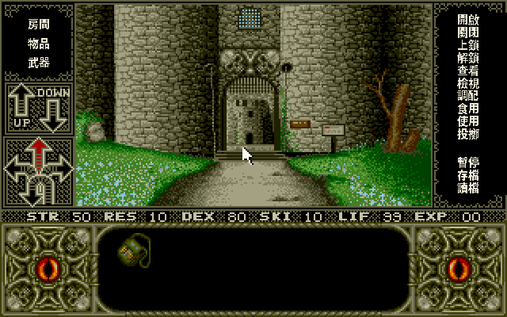

# 中文化除錯紀錄：疊層對齊與模態選單

> **2026-08-02 補充**：逐一對齊 640×400 基準座標仍不足以保證實機可點。
> Retina、4:3 校正或視窗縮放時，overlay 與遊戲各有不同 draw rect；舊版以
> `showOverlay(false)` 顯示完整 overlay，卻讓輸入依遊戲 rect 換算，造成整層
> 可見位置與 hitarea 水平錯位。現改用 overlay active area，再依執行時的
> overlay 寬高比例還原到 320×200。另在戰鬥紅底命令出現時停止覆蓋一般動詞，
> 保留 `LUNGE/HACK/BLOCK/PARRY` 等動態按鈕。

> 起因是姊妹作《艾薇拉 II 恐怖劇場》修過一批「中文字看得到、點不到」的問題，回頭排查《古堡禁地》有沒有同一類毛病。
> 結論：有，而且更嚴重——**中文動詞標籤整排比點擊判定框低了半格，點「開啟」實際觸發的是下一格的「關閉」**；
> 另外**暫停／存讀檔選單在疊層下根本畫不出來**。兩者都已修正並實機驗證。

## 一、為什麼會錯位：兩層座標系

《古堡禁地》繁中版把中文畫在 ScummVM 的 **overlay 疊層**（640×400）上，遊戲本身是 320×200。
疊層座標 = 遊戲座標 × 2，看起來單純，但有兩個陷阱：

1. **點擊判定框（hitarea）是遊戲腳本定義的固定矩形**，跟疊層無關。中文標籤畫在哪裡不影響「點了會發生什麼」——
   決定權在那個看不見的框。字與框錯開，就是「看得到、點不到」或「點到隔壁」。
2. **對白文字層走的是壓縮格**（字距 16px 而非原生 32px），為了讓小字貼合對話框。
   這條路徑對長對白很好用，但**綁判定框的選單不能走它**，否則字必然離開框。

所以修正原則是：**凡是可點的中文，一律以判定框中心為錨點直接畫**，不經一般文字路徑。

## 二、判定框真值（實測 dump）

在 `boxController` 暫時加 log，列出當下所有 in-use 判定框，得到面板的完整座標（遊戲座標 320×200）：

| id | 框 (x, y, w×h) | 對應英文標籤 |
|---|---|---|
| 0x78 | (279, 9, 33×7) | OPEN |
| 0x79 | (277, 17, 37×7) | CLOSE |
| 0x7A | (277, 25, 37×7) | LOCK |
| 0x7B | (277, 33, 37×7) | UNLOCK |
| 0x7C | (277, 41, 37×7) | LOOK IN |
| 0x7D | (277, 49, 37×7) | EXAMINE |
| 0x7E | (277, 57, 37×7) | MIX |
| 0x7F | (277, 65, 37×7) | CONSUME |
| 0x80 | (277, 73, 37×7) | USE |
| 0x81 | (277, 81, 37×7) | THROW |
| 0x82 | (277, 99, 37×7) | PAUSE |
| 0x83 | (277, 107, 37×7) | SAVE |
| 0x84 | (277, 115, 37×7) | RESTORE |
| 0x73 / 0x74 / 0x75 | (6, 12 / 24 / 36, 37×7) | ROOM / INV / WEAPONS |

交叉驗證：把譯表移開跑英文原版、量面板每一列文字的像素位置，**英文字正好落在自己的框內**
（文字上緣 = 框上緣 + 1）。所以框就是真值，中文照著擺即可。

> 量測踩雷：headless（Xvfb）下 ScummVM 視窗位在 **+10+15**，不是 (0,0)。
> 拿 `import -window root` 的截圖換算座標時得扣掉這個位移，否則會得到「英文字也沒對齊」的假結論。

## 三、逐項修正

| 症狀 | 根因 | 修正 |
|---|---|---|
| 點中文動詞觸發到隔壁動詞（點「開啟」變成關閉）| 標籤 y 值當初照畫面目測擺，比框中心低約半格（列距也用了 18px，實際是 16px）| 標籤中心改成 `2×(框y)+7`，列距 16px；x 也對齊框中心 |
| 點「暫停」沒反應 | 中文「暫停」畫在 SAVE／RESTORE 的框上 | 同上，13 個標籤全部重新對位 |
| 暫停／存讀檔選單完全看不到 | 選單期間 `haltAnimation()` 停掉 `displayScreen()`，疊層不再重新合成，玩家只看到上一幀；而疊層蓋在遊戲畫面之上 | `delay()` 在動畫停止時（`_videoLockOut & 0x10`）補做一次疊層合成 |
| 選單標題（Game Paused）不見了 | 繁中路徑的 `\r` 是 CJK 行高（+2 列），英文硬編碼訊息裡的 3 個 `\r` 直接把標題捲出視窗 | 選單不走 `windowPutChar`，改用 `chtDrawMenuBig5()` 直接畫在框中心 |
| 狀態列 EXP 數值被黑掉 | 面板黑底填到 overlay y282，吃掉了狀態列右端 | 黑底收斂成「第一個到最後一個判定框」的範圍（y16–246）|
| 暫停／存讀檔選單是英文 | 這幾段訊息硬編碼在引擎裡（`oe1_pauseGame` / `userGame` / `confirmOverWrite`），不經字串表 | 加繁中分支：遊戲暫停／繼續／結束、確定要離開嗎、插入存檔磁片並輸入檔名、檔案已存在要覆蓋嗎、是／否 |
| 讀檔後畫面殘留舊字 | 疊層文字層是持久的，不會被遊戲重繪蓋掉 | `loadGame` 結尾清空文字層；選單開關時也各清一次 |
| 手冊說按 Enter 可跳過片頭，按了沒用 | ScummVM 只把「跳過片頭」綁在 Escape | `metaengine.cpp` 為 elvira1/elvira2/waxworks 補綁 RETURN／KP_ENTER |
| 譯表 id 213「是／否」欄位 | 中文比英文短，卻沿用英文的空格數 | 依英文 `YES`(第 9 欄)／`NO`(第 18 欄)重排 |

## 四、與《艾薇拉 II》的差異

同樣是 AGOS，但兩作的中文畫布機制不同，修法也不同：

- **艾薇拉 II** 用引擎原本給 PC98 的 `_scaleBuf` 雙層畫布，疊層與遊戲畫面是 1:1 對應（×2），
  所以選單對齊只要**在譯表裡補空格**、把中文推到英文原本的欄位即可，不必改引擎。
- **古堡禁地** 走 ScummVM overlay 疊層（DOS 版強套 PC98 雙層會踩到堆積毀損），
  對白用壓縮格排版，所以**綁判定框的選單必須另走直繪路徑**，屬於引擎修改。

換句話說，同一個「中文比英文短導致錯位」的症狀，在兩作的正解不一樣——不能照抄。

## 五、驗證方式

全程 headless（Xvfb 640×400×16 + `SDL_AUDIODRIVER=dummy`）：

1. 進遊戲後點「開啟」中文字的視覺中心 → log 顯示命中 `id=0x78`（OPEN），非隔壁框。
2. 點「暫停」→ 命中 `0x82`，捲軸跳出「遊戲暫停／繼續／結束」。
3. 點「結束」→ 命中 `0x7FFE`，出現「確定要離開嗎？／是／否」。
4. 點「否」→ 回到暫停選單，無殘字。
5. 點「繼續」→ 回到遊戲，畫面乾淨。
6. 點「存檔」→ 命中 `0x83`，跳出「插入存檔磁片／並輸入檔名：」，輸入游標在正確位置。

## 六、macOS Retina：整層中文擠到左上角

玩家在 macOS 上實測回報：中文動詞面板縮成畫面中間一小塊、右側面板露出原本的英文、
畫面右緣還多出一條重複的 ROOM／INV／WEAPONS。Linux 與 Windows 都沒有這個現象。

### 兩顆連在一起的根因

疊層的所有中文座標都寫死「疊層 = 遊戲座標 ×2」，也就是預設疊層永遠是 640×400。
這個假設在 Retina 上不成立——高 DPI 螢幕下 ScummVM 的 overlay 回報的是**物理像素**，
實測是 1280×800。座標沒跟著放大，整層中文就縮在大畫布的左上四分之一。

第二顆藏在遊戲畫面的升採迴圈裡：取樣索引用的是整數倍 `ox / (ow / gw)`。
疊層寬度不是遊戲寬度的整數倍時（Retina 的物理尺寸、視窗自由縮放後的尺寸），
`ow / gw` 無條件捨去，`ox` 走到後段時索引就超過 319，讀進遊戲畫面**下一列**的像素——
畫面右緣那條重複的面板就是這樣來的。同一顆 bug 的兩個症狀。

### 為什麼一直沒被抓到

headless 驗證跑在 Xvfb 上，沒有 HiDPI，overlay 永遠是 640×400，恆等映射，永遠正確。
要重現得主動把 overlay 撐大：`--scale-factor=4` 會讓 overlay 變成 1280×800，
與 Retina 回報物理像素是同一個條件，一跑就重現，和玩家截圖一模一樣。

### 修法：基準空間 + 區間映射

現有的幾百個座標常數不動，改變它們的解釋方式——一律視為「基準空間 640×400」的座標，
畫的時候經 `chtRX() / chtRY()` 換算成實際 overlay 座標：

- **區間映射，不是乘倍率**：一個基準像素對應 `RX(x) … RX(x+1)` 這段區間。
  非整數倍（Retina 的任意物理尺寸、aspect 校正的 640×480）也不會留縫或重疊，
  乘倍率則會。
- **字模跟著等比放大**：字模的每個點展開成對應的矩形，所以 Retina 下中文的
  視覺大小與一般螢幕一致，不會縮成一小塊（見 `chtOvlBlitGlyph`）。
  描邊位移也在基準空間，一起放大。
- **升採改比例取樣** `ox * gw / ow`，索引不再越界。
- **疊層尺寸變了要重配 buffer**：Retina、切換 scale factor、視窗縮放都會改變它，
  尺寸變了還沿用舊 stride 就是踩記憶體。

`chtOvlFill / chtOvlBlitGlyph / chtOvlDrawGlyph` 三個函式收掉了原本散在各處的像素寫入迴圈，
動詞面板、對白文字層、地圖、模態選單、無敵指示器全部改走它們。
疊層剛好是 640×400 時映射是恆等的，所以一般螢幕的行為與修正前完全相同。

### 驗證

`scripts/qa_overlay_scale.sh`（跑遊戲截圖）＋ `scripts/qa_overlay_check.sh`（判定），
把各倍率的截圖統一縮回 640×400 與已知正確的 x2 比對：

| 倍率 | 實際 overlay | RMSE vs x2 | 動詞面板中文區（平均亮度／亮像素佔比）| 判定 |
|---|---|---|---|---|
| x2 | 640×400（恆等）| 0.0000 | 0.120 / 0.131 | PASS |
| x3 | 960×600 | 0.0218 | 0.120 / 0.131 | PASS |
| x4 | 1280×800（Retina 條件）| 0.0233 | 0.120 / 0.131 | PASS |

三個倍率的中文區像素統計完全相同。修正前的同一個 x3 量到的是 0.041（基準是 0.131），
差了三倍——那時中文根本不在那個區域裡。

其他情境：地圖疊層（TAB）與片頭中文標題在 x4 下位置正確；`--scale-factor=1`
（overlay 320×200，映射比 0.5 的縮小極端）中文會糊但位置正確且不崩潰；
aspect ratio 校正（640×480）標題與中文正常。
對白文字層走的是與動詞面板同一組繪製函式。headless 的互動腳本一直沒能穩定觸發到一段對白
（試過點檢視／點房間／點物品／開場取樣，x2 基準也同樣觸發不到，兩倍率行為一致），
最後是**錄推廣片時錄到的**——片中盲眼老人那段「你是誰？」「你以為像你這種黏答答的蜥蜴救得了她？」
完整顯示、貼合對話框，對白層確認正常。

> 這件事本身值得記：卡在「怎麼自動觸發一段對白」上鑽了五種方法都失敗，
> 換個管道（本來就要做的推廣片錄製）反而一次拿到。驗證訊號不一定要從原本那條路取。

> 量測踩雷（延續第二節那條）：Xvfb 下視窗位在 +10+15，**螢幕開得跟視窗一樣大時右下會被裁掉**，
> 截出來是 630×385 而不是 640×400。各倍率被裁掉的比例不同，縮回同尺寸比對就會得到
> 「哪裡都差一點」的假錯位（RMSE 卡在 0.22 降不下來，差異圖上整片均勻雜訊、
> 全黑的對話框區反而沒差異——那是取樣相位差的特徵，不是佈局錯位）。
> 正解是螢幕開得比視窗大，並且截視窗而不是截整個螢幕。

## 參考

- 疊層機制與座標：專案根 `CLAUDE.md`、[`DEV_SETUP.md`](DEV_SETUP.md)
- 防拷分析：[`COPY_PROTECTION.md`](COPY_PROTECTION.md)
- 引擎路徑逆向：[`RE_ELVIRA1_PATHS.md`](RE_ELVIRA1_PATHS.md)
